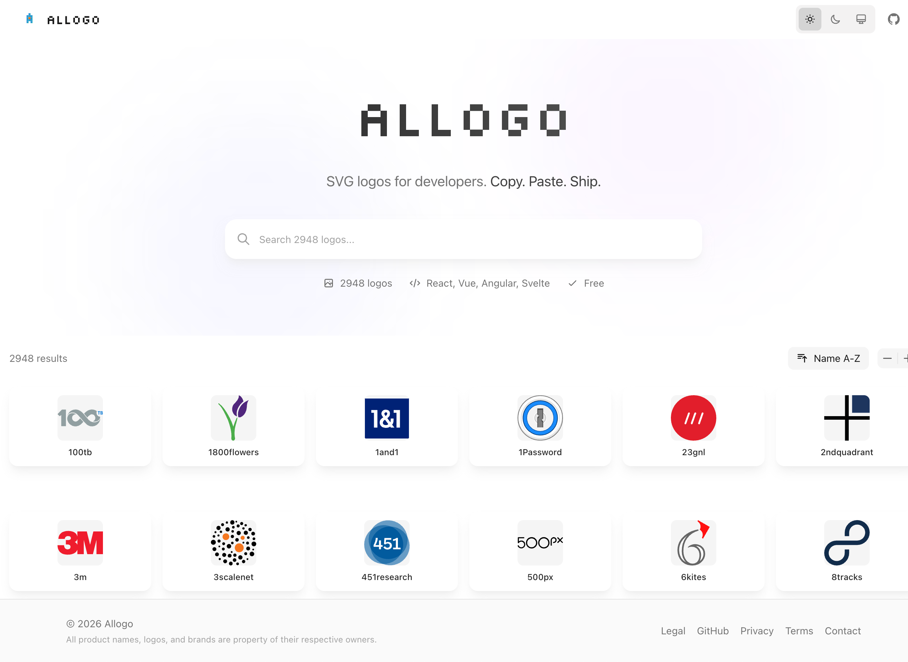

# Allogo - Logos for Developers

[English](README.md) | [中文](README.zh-CN.md)

**Allogo** is an open-source library of high-quality brand logos (SVG, PNG, JPG), designed specifically for developers. Browse, search, and download logos instantly. Each logo has a dedicated page with a **dofollow link** to the brand's official website — making it a free backlink source for your project.

For SVG logos, copy component code for React, Vue, Angular, Svelte, and plain HTML.



## Features

- **🔍 Search & Filter**: Find logos instantly by name or category.
- **⚛️ Component Ready**: Copy-paste ready code for **React**, **Vue**, **Angular**, **Svelte**.
- **🎨 Dark Mode Support**: Optimized for both light and dark themes.
- **⚡️ Fast & Lightweight**: Built with Next.js and Tailwind CSS.
- **📦 Open Data**: Powered by open data from VectorLogoZone and community contributions.

## 🔗 Free Backlinks

Every brand in Allogo gets a dedicated, SEO-optimized page (e.g. `allogo.org/logo/your-brand`) that includes a **dofollow link** pointing to the brand's official website.

**How to get a free backlink for your project:**

1. Fork this repository.
2. Add your brand logo (SVG/PNG/JPG) to `public/logos/your-brand/`.
3. Run `node scripts/update-logos.js` and fill in your website URL.
4. Submit a Pull Request.

That's it — once merged, your brand page goes live with a permanent, indexed backlink.

## Getting Started

### Prerequisites

- Node.js 18+
- pnpm

### Installation

1. Clone the repository:

   ```bash
   git clone https://github.com/callback-io/allogo.git
   cd allogo
   ```

2. Install dependencies:

   ```bash
   pnpm install
   ```

3. Run the development server:

   ```bash
   pnpm run dev
   ```

4. Open [http://localhost:3000](http://localhost:3000) in your browser.

## Contributing

We welcome contributions! Whether you want to add a missing logo or improve the code:

- **Add a Logo**: See [CONTRIBUTING.md](CONTRIBUTING.md) for instructions on how to add new SVG logos.
- **Report Issues**: Found a bug or a missing logo? Open an issue.

## License

The code is licensed under the [MIT License](LICENSE).

**Disclaimer**: All logos and trademarks are the property of their respective owners. Use for reference purposes only.
